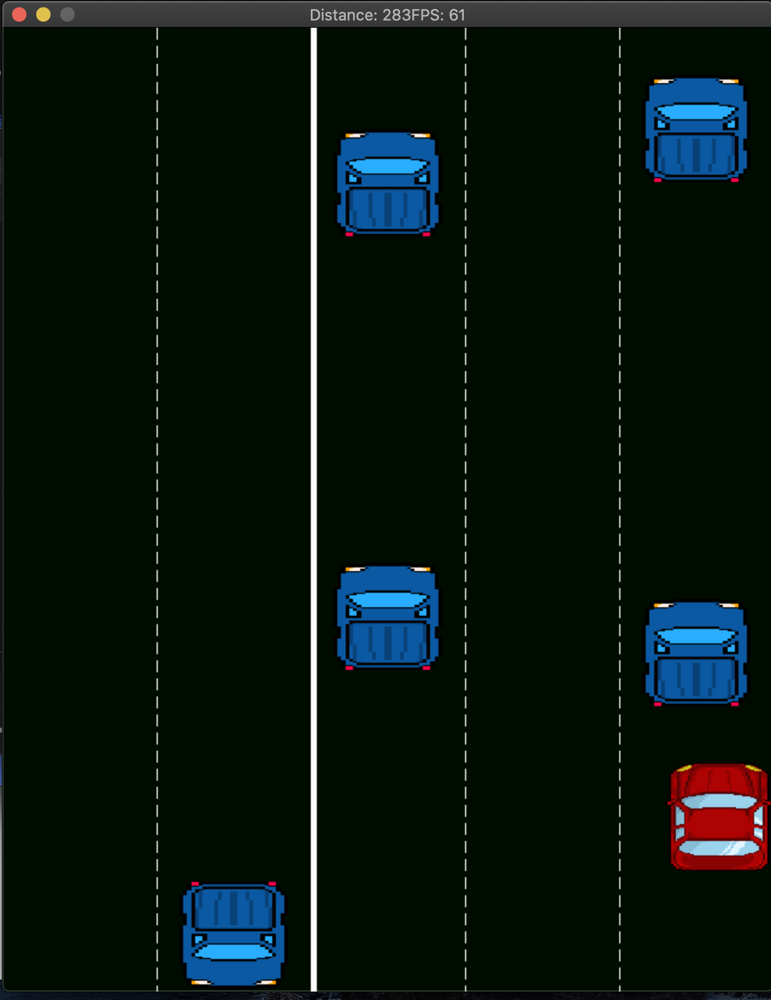

# RedCarGame

## Assets

Thanks a lot for the following assets:
- redCar ==> https://opengameart.org/content/red-car
- big truck ==> https://opengameart.org/content/top-view-car-truck-sprites
- garbage truck ==> https://opengameart.org/content/garbage-truck
 
 ## Installation Instructions
 
Required Componentes:
- SDL
-SDL_image

Install Ubuntu:
- apt-get install libsdl2-image-dev
- apt-get install libsdl2-dev

Building:
- mkdir build
- cd build
- cmake ..
- make
- ./RedCarGame

## Overview

The red car gamme is a simple pixelated game, where the redCar needs to move across five lanes and avoid colliding with the rest of the vehicles. Two lanes are in reverse direction and the cars move twice as fast, and the remainder three lanes are in the direction of the red Car. The score is increased the further the red Car goes.

## Controls

- Left key = moves the red car left
- Right key = moves the red car right
- Up key = red car accelerates and moves faster

## Structure

- Game.h/Game.cpp = Object representing the game. It contains objects for redCar, lanes and renderer. It also has private members to keep track of the game difficulty and increase it as the score/distance increases
- Vehicle.h/Vehicle.cpp = Vehicle objects that represent the cars in the lanes acting as obstacles. RedCar object inherits from vehicle
- Lane.h/Lane.cpp = Lane object that keeps track of the vehicles in each lane and destroys them when the leave sdl window. Also updates their positions through the game loop.
- Renderer.h/Renderer.cpp = Loads the textures needed for the game from the assets files, and render the information from the lane and game class
- Controller.h/Controller.cpp = Object to accept user keyboard input and change behaviour of red car accordingly

## Rubric points addressed

- Loops, functions, I/O:
  - Maps used in game.h, line 27 to store information of the probability of eacht type of vehicle
  - vector of lanes used to store the lane object inside the game class. Game.h line 23.
  - List used to keep record of vehicles in a lane. Lane.h line 60.
  - Textures are loaded from png files in the assets folder. Renderer.cpp line 40
  - User input is taken from the sdl keyboard events as listed in controls. Controller.cpp line 15 

- Object oriented programming:
  - Use of classes for games, vehicles, redCar, lanes, controller
  - Initialisation lists are used. Game.cpp line 5
  - Destructors are also used. Vehicle.cpp line 57. This one just adds a command to std::cout, but it is called when a vehicle leaves the lane to avoid running out of memory. Also in renderer.cpp line 49, in destructor resources are freed to avoid memory leak.
  - Copy constructor, move constructor and assignment overload were added. Lane.h, line 12, 15, 23
  - redCar inherits from vehicle. Vehicle.h line 77. Also constructor is overridden for redCar as it also takes and additional variable to be used in the initialisation list to mark the xlimit to avoid the redCar leaving the screen.

- Memory management:
  - Use of references and pass by value. In Renderer.cpp need to iterate over lanes and then over vehicles, this is done by value to save memory and avoid copy construction.
  - Destructors are used. Destructor of vehicle called from lane removeVehicles, lane.cpp line 40.
  - Copy and move constructors. Lane.h line 15 23. The move constructor is used for more efficiente emplace_back of the object in the lanes vector of the game object.
  - Use of scope for automatic destruction. RedCar, lanes do not need to be called to be destroyed since they are in the scope of the game object and are destructed when this one is out of the scope, which is when the game is closed. 

## For MAC

Check my other repo also called RedCar game where i have the files that work with mac. Mainly library paths are different in cmake

 
